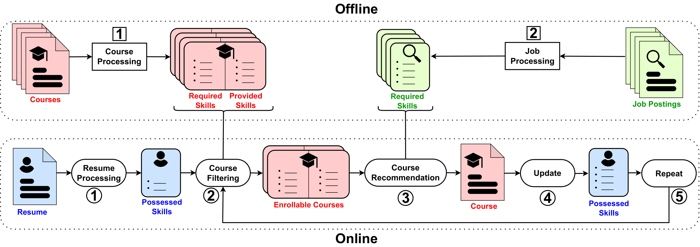

# Course Recommender Systems Need to Consider the Job Market

Repository of the SIGIR'24 paper: [Course Recommender Systems Need to Consider the Job Market](https://arxiv.org/pdf/2404.10876)



## Installation

Requires python 3.10

Install required packages via pip

```bash
pip install -r requirements.txt
```

## Usage

```bash
python src/pipeline.py --config config/run.yaml
```

Below you will find a detailed description of the parameters of the config file

```yaml
taxonomy_path: data/taxonomy.csv # Path to the taxonomy file
course_path: data/courses.json # Path to the courses file
cv_path: data/resumes.json # Path to the resumes file
job_path: data/jobs.json # Path to the jobs file
mastery_levels_path: data/mastery_levels.json # Path to the mastery levels file
results_path: results # Path to the results directory where results are saved
level_3: true # Whether to use only the third level of the taxonomy and not the fourth  (if true: less skills)
nb_courses: 100 # Number of courses to use (set to -1 to use all)
nb_cvs: -1 # Number of resumes to use (set to -1 to use all)
max_cv_skills: 15 # Maximum number of skills per resume
nb_jobs: 100 # Number of jobs to use (set to -1 to use all)
threshold: 0.8 # Threshold for the similarities
k: 2 # Number of courses to recommend
model: greedy # Model to use (greedy, optimal, dqn, ppo, a2c)
total_steps: 50000 # Total number of steps for the training of the agent
eval_freq: 5000 # Frequency of the evaluation of the agent
nb_runs: 1 # Number of runs (set to 1 for greedy and optimal since they are deterministic)
seed: 42 # Seed for the random number generator
```


## Description of src files

- [pipeline.py](src/pipeline.py): Trains and evaluate the agents, or heurisitc apporoaches.
- [Greedy.py](src/Greedy.py): Class that implements the greedy recommendation strategy.
- [Optimal.py](src/Optimal.py): Class that implements the optimal recommendation.
- [Reinforce.py](src/Reinforce.py): Class that implements the training and evaluation of the Reinforcement-based recommendation using agents from [stable_baselines3](https://stable-baselines3.readthedocs.io/en/master/).
- [CourseRecEnv.py](src/CourseRecEnv.py): Class that implements the evironment for training the agents using the [gymnasium](https://gymnasium.farama.org/index.html) library.
- [Dataset.py](src/Dataset.py): Class that implments the dataset using resumes, courses and jobs.
- [matchings.py](src/matchings.py): Contains various matching, similarity, and relevance functions.

## Citation

```tex
@inproceedings{10.1145/3626772.3657847,
author = {Frej, Jibril and Dai, Anna and Montariol, Syrielle and Bosselut, Antoine and K\"{a}ser, Tanja},
title = {Course Recommender Systems Need to Consider the Job Market},
year = {2024},
isbn = {9798400704314},
publisher = {Association for Computing Machinery},
address = {New York, NY, USA},
url = {https://doi.org/10.1145/3626772.3657847},
doi = {10.1145/3626772.3657847},
pages = {522–532},
numpages = {11},
keywords = {course recommendation, entity linking, recommender system},
location = {Washington DC, USA},
series = {SIGIR '24}
}
```
